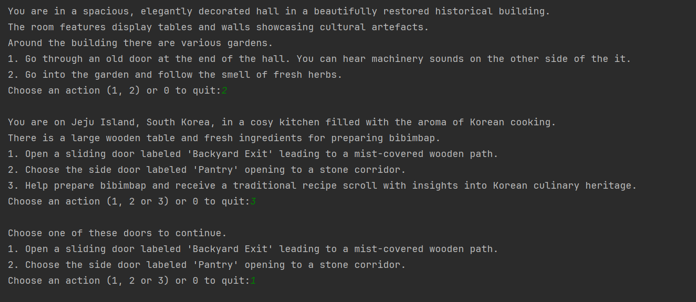

# World Tales Quest
Welcome to World Tales Quest, a text-based adventure game in C++.
In this global journey, the player will traverse diverse cultural landscapes, solve intriguing tasks and collect unique artifacts to complete the quest.

### Game Overview
Embark on an adventure through various settings around the world.
The goal is to gather specific items by solving tasks and making decisions at each crossroads.
All artifacts must be placed in the final room to complete the game.
Paths and tasks vary and items cannot be re-collected if the player revisits a location.

### Rooms
- New Zealand Director's Studio
- Bangladeshi Garment Factory
- Fisher's Dock in Ghana
- London Urban Community Garden
- Bibimbap Cook's Kitchen on Jeju Island
- Final Room: The Global Heritage Hall

### How to Play
- Navigate through locations by choosing pathways or completing room-specific tasks.
- Collect cultural artifacts from each location.
- Revisited rooms/locations will no longer display previously collected items.
- Place all collected artifacts in the Final Room to win.

### Inspiration
Inspired by a VR exhibition I saw called 'We Are At Home' by Michelle and Uri Kranot, which allowed exploration through different rooms with a common theme.
This text-based game adapts that concept with added tasks and cultural locations.

### Example
